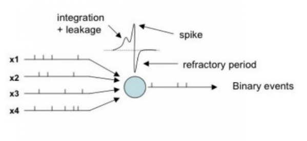
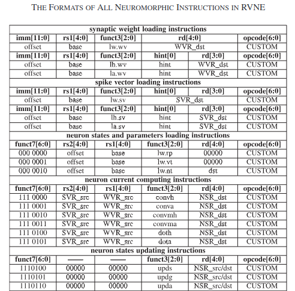
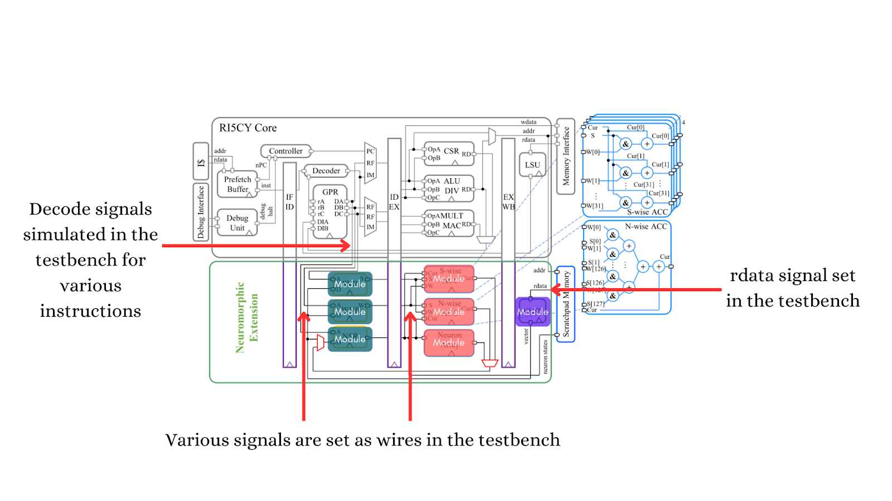
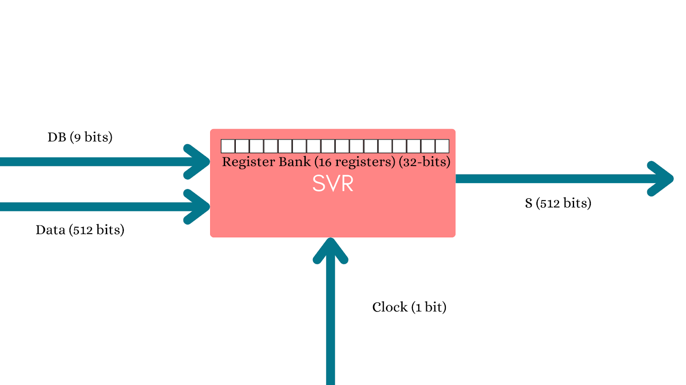
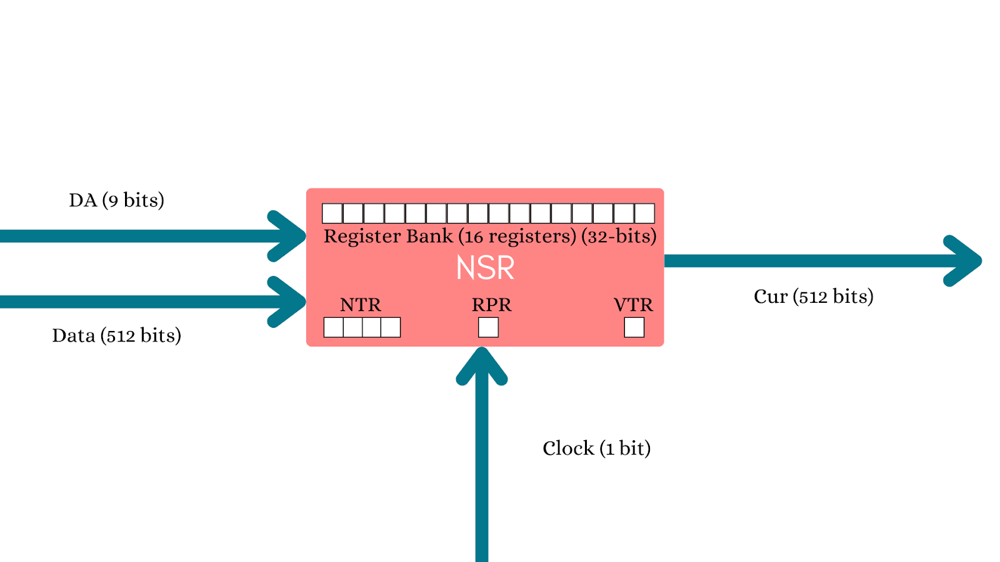
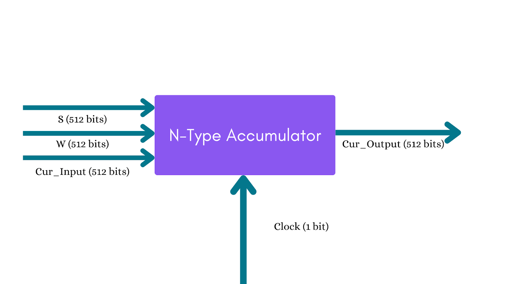
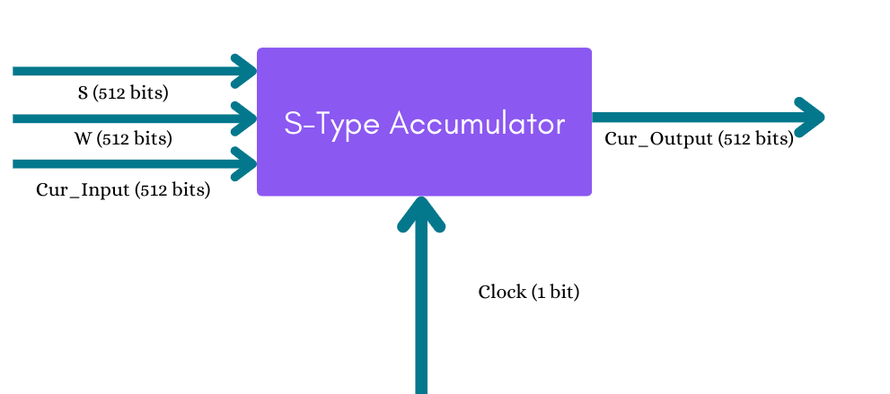
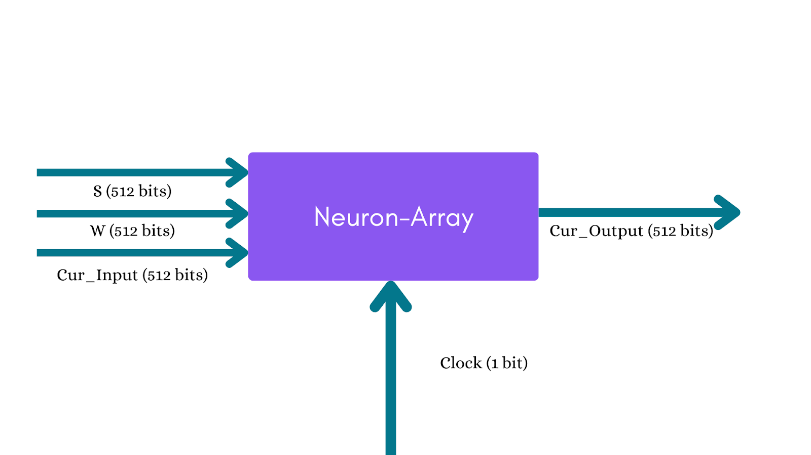

# **RVNE ISA - RTL**

# **Introduction**

This project implements most of RVNE Instruction Set Architecture (ISA) in RTL as specified in the paper “Back to Homogeneous Computing: A Tightly-Coupled Neuromorphic Processor With Neuromorphic ISA” (IEEE TRANSACTIONS ON PARALLEL AND DISTRIBUTED SYSTEMS, VOL. 34, NO. 11\)

## **Spiking Neural Networks (SNN)**

The features of RVNE make them highly suitable for real-time data processing and complex decision-making applications. SNNs, which rely on discrete spikes for communication instead of continuous signals, are naturally aligned with this computing paradigm.

It incorporates specialized instructions to manage synaptic weights, spikes, neuron states, and both neuron-wise and synaptic-wise current computations. By addressing these needs, the ISA facilitates efficient processing and supports the inherent parallelism of neuromorphic systems. 

The following diagram illustrates all the essential actions required for a SNN.

## **RVNE ISA**

The following instructions were implemented:

# **Approach**

The Verilog code and testbench replicate the workings of the neuromorphic extension part of the proposed NeuroRV Core.

Every Unit (SVR, NVR, WVR, S-Wise ACC) is a module in the Verilog code with appropriate input and output signals provided in the testbench to emulate various instructions accordingly.  

The testbench emulates the different signals sent to the modules for execution. For example, for “lw.wv”, the DC signal would be triggered, sending funct3 \+ rd of 0000 \+ rd to take the first 32 bits of the bus to store at the appropriate rd register.

## **Assumptions**

* DA, DB, and DC Signals are 9-bits for uniformity.

* Data, S, W, and Cur bus are taken as 512 bits for uniformity.

* One spike is 1-bit.

* One weight is 4-bits.

* One current is 4-bits.

* Funct3 has been modified to include 4 bits.

* All registers are 32 bits.

* NTR is 4 bits (1111 to represent a spike and 0000 for inhibiting). This decision was made to match the width of the current of a neuron (4 bits) to make neuron state updating easy (Refer to the explanation under NSR Module for more details).

* The formula used for calculating membrane potential:
$$V = I \cdot Resistance (0.04) + Rest\ Potential(0.01)$$

## **Modules**

### SVR

#### 

#### Data Signal

As per our assumptions, 1 bit \= 1 spike. Since neuron computation instruction uses at-most 128 neurons, only 128 bits of this bus will be used in the maximum case.

#### DB Signal

Consists of funct (4-bits) \+ rd (5-bits). The following funct numbers are used for various cases

1. **0000**: Takes first 32 bits of Data bus and stores it in rd (32 neurons’ spike data)

2. **0001**: Takes first 128  bits of Data bus and stores it in four consecutive registers starting from rd (128 neurons’ spike data)

3. **0010**: Takes 512 bits of the data bus and stores it in all 16 registers.

4. **0011**: Loads 1 register (32 neurons’ spike data) onto first 32 bits of S bus.

5. **0100**: Loads 4 registers (128 neuron’s spike data) onto first 128 bits of S bus.

### WVR

#### Data Signal

As per our assumptions, 4-bits \= 1 weight. Since neuron computation instruction uses at most 128 neurons, all 512 bits of this bus will be used in the maximum case.

#### DC Signal

Consists of funct (4-bits) \+ rd (5-bits). The following funct numbers are used for various cases

1. **0000**: Takes the first 32 bits of Data bus and stores it in rd (8 neurons weight data).  
2. **0001**: Takes the first 128  bits of Data bus and stores it in four consecutive registers starting from rd (32 neurons’ weight data).  
3. **0010**: Takes 512 bits of the data bus and stores it in all 16 registers (128 neurons’ spike data).  
4. **0011**: Loads four registers (32 neurons’ spike data) onto the first 128 bits of S bus.  
5. **0100**: Loads 16 registers (128 neuron’s spike data) onto 512 bits of S bus.

### NSR

#### Data Signal

As per our assumptions, 4-bits \= 1 current. Since neuron computation instruction uses at-most 128 neurons, all 512 bits of this bus will be used in the maximum case.

#### DC Signal

Consists of funct (4-bits) \+ rd (5-bits). The following funct numbers are used for various cases

1. **0000**: Takes the first 32 bits of the data bus and stores them in RPR.

2. **0001**: Takes the first 32 bits of Data bus and stores it in VTR.

3. **0010**: Takes the first 128 bits of data bus and stores them in all four NPR registers (NPR data of 32 neurons).

4. **0011**: Stores current of 32 Neurons onto 4 consecutive registers indexed by rd. This funct3 is used for convh/doth

5. **0100**: Stores current of 128 Neurons onto all 16 registers. This funct3 is used for conva/dota

6. **0101**: Takes the first 4 bits of data bus and stores it in the first 4 bits of the register indexed by rd (Updating one neuron). 

7. **0110**: Takes the first 16 bits of data bus and stores it in the first 16 bits of the register indexed by rd (Updating 4 neurons’ current). Used in convmh.

8. **0111**: Takes the first 64 bits of data bus and stores it in two consecutive registers indexed by rd (Updating 16 neurons’ current). Used in convma.

9. **1000**: Update states of one NTR register. 

10. **1001**: Update states of all 4 NTR registers.

#### State Updating

The algorithm for state updating is as follows:

1. If RPR \== 0\.

   1. For every four bits from 0 \- 32 \[i \* 4 \+: 4\]:

      1. Fetch current from current\_register indexed by rd for the same bits \[i \* 4 \+: 4\]. 

      2. Calculate potential.

      3. If potential has crossed VTR:

         1. If it does, set the NTR of those four bits to 1111\. 

### NAcc

#### S Signal

Input 32 bits (32 Neurons’ spike data) or 128 bits (128 Neurons’ spike data) sent by SVR.

#### W Signal

Input 128 bits (32 Neurons’ spike data) or 512 bits (128 Neurons’ spike data) sent by WVR.

#### Cur\_Input Signal

Initially 0, Cur\_Input signal is updated with one of  Cur\_Output from N-Type, S-Type, and Neuron Array after computation.

#### Accumulation Logic

Computation is done for all 128 neurons across the bus regardless of whether the input is 32 or 128 from S/W. NeuroRV Core doesn’t specify any signal going into the Accumulator. Hence, for instructions like “doth/convh” if only 32 neurons are loaded, other bits of the S signal is 0, and other bits of Cur\_Output are computed as 0\. Moreover, NSR will only store one (4/16 in convmh/convma \- refer to Neuron Array Module) neuron, taking the first 4 bits of the Cur\_Output bus.

The following formulae are used to compute N-Type Accumulation (one neuron’s output current):    
$$\sum_{i = 0}^{128} S[i] \cdot W[j] \quad \text{where} \quad j = i \cdot 4 + 4 + \text{Cur\_input}(3 : 0)
$$

### SAcc

#### S Signal

Input 32 bits (32 Neurons’ spike data) or 128 bits (128 Neurons’ spike data) sent by SVR.

#### W Signal

Input 128 bits (32 Neurons’ spike data) or 512 bits (128 Neurons’ spike data) sent by WVR.

#### Cur\_Input Signal

Initially 0, Cur\_Input signal is updated with one of  Cur\_Output from N-Type, S-Type, and Neuron Array after computation.

#### Accumulation Logic

Similar to N-Type, computation is done for all 128 neurons of the S/W/Cur bus regardless of the input/output. The following equation is used to compute the S-type. 
$$Cur\_Output[i\cdot4+:4] = (S[0] \cdot W[i\cdot4 +: 4]) + Cur\_Input[i\cdot4 +: 4]
$$ 

### NeuronArray

#### S Signal

Input 128 bits (128 Neurons’ spike data) sent by SVR.

#### W Signal

Input 512 bits (128 Neurons’ spike data) sent by WVR.

#### Cur\_Input Signal

Initially 0, the Cur\_Input signal is updated with one of  Cur\_Output from N-Type, S-Type, and Neuron Array after computation.

#### Accumulation Logic

Since convmh/convma takes in 128 neurons as input from SVR, WVR, and NSR, we utilize 128 bits of S signal and 512 bits of W signal. Since Computation is done for 4/16 neurons, S-type computation is done for all 16 neurons. The module sends a 16-bit output signal in Cur\_Output (works for 4 neurons case as bits of other 12 neurons will be 0, and NSR would be taking the first 16 bits / 4 neurons of the bus to store in one register as appropriate DA signal will be sent).